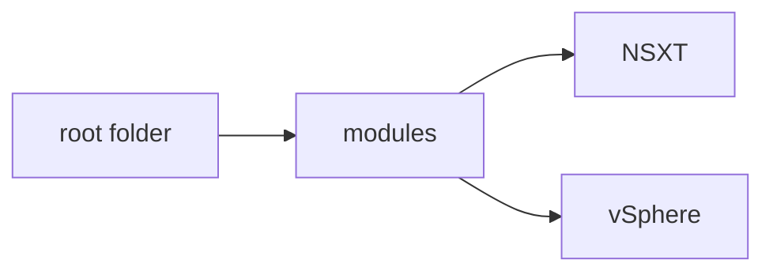

# Deploying and Managing your SDDC with IaC
The scripts in this repo were built for the consumption of anyone interested in building an VMware Cloud on AWS Software Defined DataCenter (SDDC), configure NSXT and build out VMs. Then use Ansible to manage those VMs that were deployed.

This repo is a work in progress and will be continuously updated.  Please check back often.

**NOTE:** I have removed any specific data to my setup and environment.  So you will need to setup those pieces before the script will work.  Please see below as to what needs to be setup for the script to work.

# Terraform Setup

## Folder Structure
In the demo video and the presentation you see the folder structure I setup.  This is the recommended best practice from Hashicorp.



## Variable Declaration
There are 3 different ways that a variable can be declared within a Terraform script.

1. Create a variable.tf file
2. Set as an environment variable (export TF_VAR_*variable_name*)
3. Prompt for the variable value at the time of script execution

### Variable.tf file
Here is an example of a variables.tf file.  This example file has all the minimum requirements to build an SDDC.

```
variable "sddc" {
    type = map(string)
    default = {
        "name"            = "example SDDC"
        "region"          = "us-east-1"
        "vpc_cidr"        = 10.0.0.0/16
        "vxlan_subnet"    = 192.168.1.0/24
        "public_ip_name"  = "Public_VM_IP"
        "number_of_hosts" = 1
        "instance_type"   = "i4i_metal"
        "sddc_type"       = "1NODE"
        "deployment_type" = "SingleASZ"
        "provider"        = AWS
    }
}